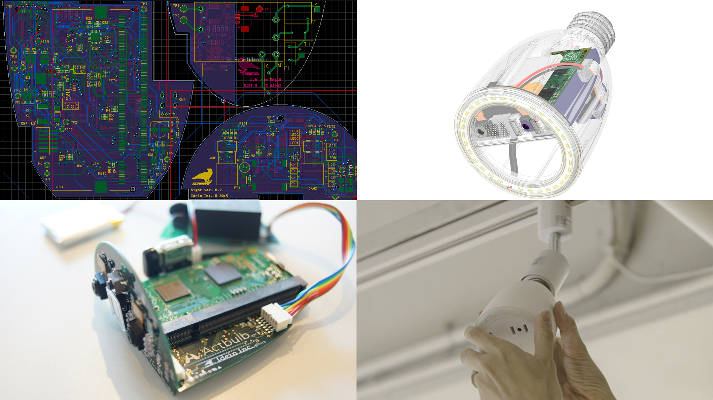
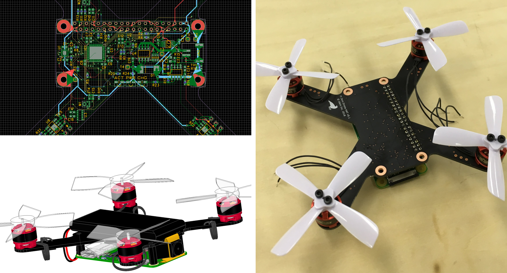

# **Koichi Nakamura (中村晃一)**

## Titles

- CEO&Founder of [Idein Inc.](https://idein.jp)

- [Arm Innovator](https://community.arm.com/innovation/b/blog/posts/new-arm-innovators-iot-experts-physicists-robotic-inventors)

## Accounts

- [Twitter](https://twitter.com/9_ties)
- [Linkedin](https://www.linkedin.com/in/koichinakamura/)
- [Facebook](https://www.facebook.com/koichi.nak)
- [Github](https://github.com/nineties)
- [Speakerdeck](https://speakerdeck.com/nineties/)
- [Qiita](https://qiita.com/9_ties)

## Career

- Born in 1984.
- 2003- The University of Tokyo
- 2010- Graduate School of Information Science and Technology, University of Tokyo. Dept. of Compute Science. (dropped out in 2015)
  - My major was a theory of optimizing compiler for parallel computing
- 2015.4 Founded Idein Inc.
- 2016.3- Be a technical advisor of DG Lab
- 2018.9- Selected as an Arm Innovator

## Interviews

- [アマテラス CEOインタビュー](https://amater.as/article/interview/idein/)
- [異能エンジニアの肖像](https://tech.nikkeibp.co.jp/atcl/nxt/column/18/00240/)
  - [ユーザーはアプリを選ぶだけ、1日100円程度で使えるエッジAIを提供](https://tech.nikkeibp.co.jp/atcl/nxt/column/18/00240/052800032/)
  - [「伝説」の勉強会、きっかけはアインシュタインも在籍していた米研究所](https://tech.nikkeibp.co.jp/atcl/nxt/column/18/00240/052900033/)
- [Forbes Japan 2019年1月号](https://forbesjapan.com/magazines/detail/87)
  - AI IoT活用に価格破壊！「組み込みディープラーニング」世界へ
- [安価な組み込みAIを世界へ！ Ideinが「高火力」を選んだ理由](http://ascii.jp/elem/000/001/726/1726225/)
- [毎日新聞 2018年8月27日東京朝刊](https://mainichi.jp/articles/20180827/ddm/008/020/036000c)

## Works & Activities
### Software Projects

- [Amber](https://github.com/nineties/amber)
  - [Creating a language using only assembly language](https://speakerdeck.com/nineties/creating-a-language-using-only-assembly-language)
  - [アセンブリ言語のみで言語処理系を作った話](https://speakerdeck.com/nineties/bootstrap)
- [py-videocore](https://github.com/nineties/py-videocore)
  - Python library for GPGPU on Raspberry Pi
- [PlanckForth](https://github.com/nineties/planckforth)
  - Bootstrapping an Interpreter from Handwritten 1KB Binary

### Hardware Projects

- Actbulb (Past project at Idein. Not for sale)
  - Smart lightbulb with vision sensors
  - Circuit design, PCB design, 3D CAD

- PiZero Cluster Board (Past project at Idein. Not for sale)
  - Circuit design, PCB design 

- PiZero Drone HAT (Ongoing hobby project. Not for sale)
  - Circuit design, PCB design, Mechanical design, flight controller

### Math Lectures or Materials
(Only in japanese)

- 圏論勉強会: [資料](http://nineties.github.io/category-seminar/) [動画](https://www.youtube.com/playlist?list=PLzJWjr7AvxH37O6GPqx20NpF0HaSrndVc)
- プログラマの為の数学勉強会: [資料](http://nineties.github.io/math-seminar/) [動画](https://www.youtube.com/playlist?list=PLzJWjr7AvxH0YYpi2uAH_QHLaSJQ5fZrR)
- パターン認識と機械学習勉強会: [資料](http://nineties.github.io/prml-seminar/) [動画](https://www.youtube.com/playlist?list=PLZUl2daVfjB2M2nzTBXWx5z_IA9u3Ob6x)
- 機械学習に基づく自然言語処理勉強会: [資料](http://nineties.github.io/NLP-seminar/) [動画](https://www.youtube.com/playlist?list=PLl1oX4Yc8CJail3kBuQZJye6rKpS7hoHw)
- 多様体上での最適化問題: [資料](https://nineties.github.io/manifold-optimization)

### Lectures & Presentations

- [SSII2019](https://confit.atlas.jp/guide/event/ssii2019/static/organized)
    - オーガナイズドセッション3 「深層学習の高速化」オーガナイザ
- [AI/SUM 2019](https://aisum.jp/)
    - Panel session: How Do AI Startups Solve Societal Issues in Japan
    - Presentation: Edge Computing: The key Technology for Social Implementation of AI
- [fpgax #11 ＋ TFUG ハード部：DNN専用ハードについて語る会](https://fpgax.connpass.com/event/115446/)
  - Slide (Japanese): [Deep Learning推論を高速化するソフトウェア技術](https://speakerdeck.com/nineties/deep-learningtui-lun-wogao-su-hua-surusohutoueaji-shu)
- Deloitte Tohmatsu Innovation Summit
  - Panel session about "Augmented intelligence".
- Deep Learning Lab/推論ナイト
  - [Presentation (Japanese)](https://youtu.be/-t_9Qpd0gn8?t=8074)
  - Slide (Japanese): [Ideinの紹介](https://speakerdeck.com/nineties/ideinfalseshao-jie-at-dllab-tui-lun-naito)
- Deep Learning Acceleration勉強会
  - Organizer
  - Slide (Japanese): [Convolutionの数理とアルゴリズム](https://speakerdeck.com/nineties/convolutionfalseshu-li-toarugorizumu)
- [Raspberry Pi Fields 2018](https://www.raspberrypi.org/raspberry-fields/)
  - Presentation: [Accelerating deep learning inference on Raspberry Pi](https://www.youtube.com/watch?v=10RyDvTj4hc)
- [The New Context Conference](http://ncc.garage.co.jp/ja/)
  - 2016 Tokyo (presentation & panel session), 2017 Tokyo (presentation & panel session), 2018 Tokyo (panel session)
