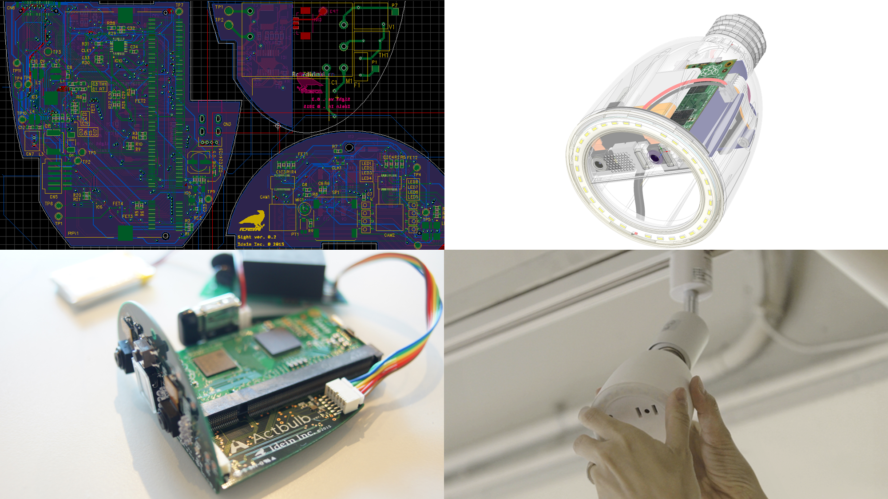
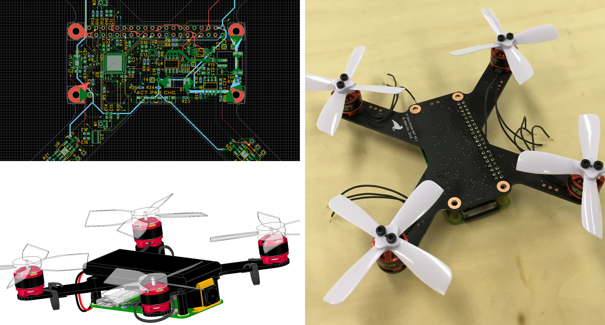

# **中村晃一 (Koichi Nakamura)**

## 肩書き

- [Idein株式会社](https://idein.jp) 代表取締役

- 東北大学 共創戦略センター 客員教授

## アカウント

- [Twitter](https://twitter.com/9_ties)
- [Linkedin](https://www.linkedin.com/in/koichinakamura/)
- [Facebook](https://www.facebook.com/koichi.nak)
- [Github](https://github.com/nineties)
- [Speakerdeck](https://speakerdeck.com/nineties/)
- [Qiita](https://qiita.com/9_ties)

講演依頼・執筆依頼は koichi@idein.jp まで。

## 経歴

- 1984年 生まれ
- 2003年 東京大学 入学
- 2010年 東京大学大学院 情報理工学系研究科 コンピュータ科学専攻 (2015年 中退)
  - 専門は並列計算向け最適化コンパイラの理論
- 2015年4月 Idein株式会社 創業
- 2016年3月 DG Lab 技術顧問
- 2018年9月 Arm Innovator に選出

## インタビュー

- [アマテラス CEOインタビュー](https://amater.as/article/interview/idein/)
- [異能エンジニアの肖像](https://tech.nikkeibp.co.jp/atcl/nxt/column/18/00240/)
  - [ユーザーはアプリを選ぶだけ、1日100円程度で使えるエッジAIを提供](https://tech.nikkeibp.co.jp/atcl/nxt/column/18/00240/052800032/)
  - [「伝説」の勉強会、きっかけはアインシュタインも在籍していた米研究所](https://tech.nikkeibp.co.jp/atcl/nxt/column/18/00240/052900033/)
- [Forbes Japan 2019年1月号](https://forbesjapan.com/magazines/detail/87)
  - AI IoT活用に価格破壊！「組み込みディープラーニング」世界へ
- [安価な組み込みAIを世界へ！ Ideinが「高火力」を選んだ理由](http://ascii.jp/elem/000/001/726/1726225/)
- [毎日新聞 2018年8月27日東京朝刊](https://mainichi.jp/articles/20180827/ddm/008/020/036000c)
- [スタクラ CEOインタビュー](https://startupclass.co.jp/article/2021/05/18/idein/)
- [週刊BCN+](https://www.weeklybcn.com/journal/era/detail/20220519_190937.html)
- [PR TIMES STORY](https://prtimes.jp/story/detail/orokwqS8Myr)
- [TECHBLITZ Startup Interview](https://techblitz.com/startup-interview/idein/)
- [さくマガ 対談「AIが溶け込む社会への挑戦」](https://sakumaga.sakura.ad.jp/entry/idein/)
- [ZUU online インタビュー](https://zuuonline.com/archives/293222)
- [社長名鑑 インタビュー](https://shachomeikan.jp/industry_article/3215)
- [INTLOOP Ventures 特別対談](https://www.intloop.com/intloopventures/interview/crosstalk1-3/)

## 活動
### 講演・発表

- [SSII2019](https://confit.atlas.jp/guide/event/ssii2019/static/organized)
    - オーガナイズドセッション3 「深層学習の高速化」オーガナイザ
- [AI/SUM 2019](https://aisum.jp/)
    - パネルセッション: How Do AI Startups Solve Societal Issues in Japan
    - 講演: Edge Computing: The key Technology for Social Implementation of AI
- [fpgax #11 ＋ TFUG ハード部：DNN専用ハードについて語る会](https://fpgax.connpass.com/event/115446/)
  - 資料: [Deep Learning推論を高速化するソフトウェア技術](https://speakerdeck.com/nineties/deep-learningtui-lun-wogao-su-hua-surusohutoueaji-shu)
- Deloitte Tohmatsu Innovation Summit
  - 「Augmented intelligence」についてのパネルセッション
- Deep Learning Lab/推論ナイト
  - [講演](https://youtu.be/-t_9Qpd0gn8?t=8074)
  - 資料: [Ideinの紹介](https://speakerdeck.com/nineties/ideinfalseshao-jie-at-dllab-tui-lun-naito)
- Deep Learning Acceleration勉強会
  - オーガナイザ
  - 資料: [Convolutionの数理とアルゴリズム](https://speakerdeck.com/nineties/convolutionfalseshu-li-toarugorizumu)
- [Raspberry Pi Fields 2018](https://www.raspberrypi.org/raspberry-fields/)
  - 講演: [Accelerating deep learning inference on Raspberry Pi](https://www.youtube.com/watch?v=10RyDvTj4hc)
- [The New Context Conference](http://ncc.garage.co.jp/ja/)
  - 2016 東京 (講演・パネルセッション)、2017 東京 (講演・パネルセッション)、2018 東京 (パネルセッション)
- [EdgeTech+ 2022](https://www.jasa.or.jp/expo/2022/)
- [JETRO × Hello Tomorrow Japan 「Deep Techで世界を目指せ」](https://www.youtube.com/watch?v=2qKPoBe8w20)
  - パネルセッション
- [ILS2023 Innovation Leaders Summit](https://ils.tokyo/event_2023/)
- [SMART CITY REVERSE PITCH](https://www.idein.jp/ja/news/240126-smartcity-event)
  - 対談登壇: スマートシティ領域のセクター横断協業事例
- [第21回 M2M・IoT研究会 専門部会セミナー](https://www.m2msg.org/?p=5981)
  - 講演: マルチモーダルLLMのリアル空間向け活用の技術とビジネス応用
- [MWC Barcelona 2025](https://www.idein.jp/ja/news/250128-kddi-mwc2025-ai-signage)
  - KDDIスタートアップピッチ「Meet Japan's Next Unicorns!」登壇
- [「製造業×AIで未来を創る」オンラインセミナー（さくらインターネット共催）](https://www.idein.jp/ja/news/sakura-internet-event-251001)
  - Raspberry Pi × Actcastで現場発での工場DXを加速

### 数学の講義・資料

- 圏論勉強会: [資料](http://nineties.github.io/category-seminar/) [動画](https://www.youtube.com/playlist?list=PLzJWjr7AvxH37O6GPqx20NpF0HaSrndVc)
- プログラマの為の数学勉強会: [資料](http://nineties.github.io/math-seminar/) [動画](https://www.youtube.com/playlist?list=PLzJWjr7AvxH0YYpi2uAH_QHLaSJQ5fZrR)
- パターン認識と機械学習勉強会: [資料](http://nineties.github.io/prml-seminar/) [動画](https://www.youtube.com/playlist?list=PLZUl2daVfjB2M2nzTBXWx5z_IA9u3Ob6x)
- 機械学習に基づく自然言語処理勉強会: [資料](http://nineties.github.io/NLP-seminar/) [動画](https://www.youtube.com/playlist?list=PLl1oX4Yc8CJail3kBuQZJye6rKpS7hoHw)
- 多様体上での最適化問題: [資料](https://nineties.github.io/manifold-optimization)
- トポス理論: [資料](https://nineties.github.io/topos-theory/overview/)

### ソフトウェア

- [Amber](https://github.com/nineties/amber)
  - [Creating a language using only assembly language](https://speakerdeck.com/nineties/creating-a-language-using-only-assembly-language)
  - [アセンブリ言語のみで言語処理系を作った話](https://speakerdeck.com/nineties/bootstrap)
- [py-videocore](https://github.com/nineties/py-videocore)
  - Raspberry Pi 上で GPGPU を行う Python ライブラリ
- [PlanckForth](https://github.com/nineties/planckforth)
  - 手書きの1KBのバイナリからインタプリタをブートストラップする

### ハードウェア

- Actbulb (Ideinでの過去のプロジェクト。非売品)
  - 画像センサを内蔵したスマート電球
  - 回路設計、基板設計、3D CAD

- PiZero Cluster Board (Ideinでの過去のプロジェクト。非売品)
  - 回路設計、基板設計

- PiZero Drone HAT (個人プロジェクト、進行中。非売品)
  - 回路設計、基板設計、機構設計、フライトコントローラ

